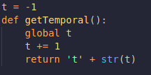
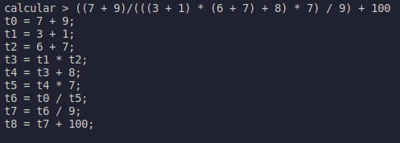

# Código de tres direcciones

Organización de Lenguajes y Compiladores 2\
Sección B+\
Exámen Corto 2 - 201700686


## Calculadora-C3D

Esquema de traducción posfijo para un analizador ascendente que recibe como entrada una expresión aritmetica (+,-,*,/ y parentésis) y coódigo de tres direcciones equivalente utilizando la herramiente de analisis sintactico PLY implementado en python.

### Tokens

```
      SUMA = +                    RESTA = -                   PARIZQ = (
      MULTIPLICA = *              DIVIDE = /                  PARDER = )
      
      ENTERO = 'r\d+'     
      DECIMAL = r'\d+\.\d+'    
      ID = r'[A-Za-z0-9_][A-Za-z0-9_]*'
```


### Gramatica y Esquema de Traducción posfijo

```
      ---------------------------------------------------------------------------------------------------
      |  Gramatica    |                               Regla Gramatical                                  |
      |-------------  | --------------------------------------------------------------------------------|
      | I -> E        |  {I.nodo = E.nodo  print(I.c3d)}                                                |
      |-------------  | --------------------------------------------------------------------------------|
      | E -> E + T    |  {E.nodo = Nodo(temporal = getTemporal())                                       |
      |               |   E.c3d = E1.c3d + T.c3d + E.temporal + '=' + E1.temporal + '+' + T.temporal}   |
      |-------------  | --------------------------------------------------------------------------------|
      | E -> E - T    |  {E.nodo = Nodo(temporal = getTemporal())                                       |
      |               |   E.c3d = E1.c3d + T.c3d + E.temporal + '=' + E1.temporal + '-' + T.temporal}   |
      |-------------  | --------------------------------------------------------------------------------|
      | E -> - T      |  {E.nodo = Nodo(temporal = getTemporal())                                       |
      |               |   E.c3d = T.c3d +  E.temporal + '= 0 - ' + T.temporal }                         |
      |-------------  | --------------------------------------------------------------------------------|
      | E -> T        |  {E.nodo = Nodo(T.temporal,T.c3d)}                                              |
      |-------------  | --------------------------------------------------------------------------------|
      |               |  {T.nodo = Nodo(temporal = getTemporal())                                       |
      | T -> T * F    |   T.c3d = T1.c3d + F. c3d + T.temporal + '=' + T1.temporal + '*' + F.temporal}  |
      |-------------  | --------------------------------------------------------------------------------|
      | T -> T / F    |  {T.nodo = Nodo(temporal = getTemporal())                                       |
      |               |   T.c3d = T1.c3d + F. c3d + T.temporal + '=' + T1.temporal +  '/' + F.temporal} |
      |-------------  | --------------------------------------------------------------------------------|
      | T -> F        |  {T.nodo = Nodo(F.temporal,F.c3d)}                                              |
      |-------------  | --------------------------------------------------------------------------------|
      | F -> ( E )    |  {F.nodo = Nodo(E.temporal,E.c3d)}                                              |
      |-------------  | --------------------------------------------------------------------------------|            
      | F -> ENTRO    |                                                                                 |
      |    | DECIMAL  |  {F.nodo = Nodo(temporal = F.value)}                                            |
      |    | ID       |                                                                                 |
      ---------------------------------------------------------------------------------------------------
```

### Implementacion en python
#### Clase Nodo
Clase que nos permitira almacenar nuestras variables temporales y nuestro código de tres direcciones.

<p align="center">
  
</p>

#### Funcion getTemporal
Funcion que nos permitira manejar nuestras varialbes temporales.

<p align="center">
  
</p>

#### Implementacion de Gramatica y Reglas Gramaticales
El codigo de la implementacion de la gramatica y reglas gramaticales se encuentran el archivo calculadora.py.

### Ejemplos
Se analizaran las siguientes entradas para obtener como salida el codigo de tres direcciones equivalente a la expresion aritmetica.

#### 1. (a + b) * (a + c)
<p align="center">
  
</p>

#### 2. x * x
<p align="center">
  
</p>

#### 3. y * y
<p align="center">
  
</p>

#### 4. x2 + y2
<p align="center">
  
</p>

#### 5. b + c + d
<p align="center">
  
</p>

#### 6. a * a + b * b
<p align="center">
  
</p>

#### 7. 5 + 2 * b
<p align="center">
  
</p>

#### 8. 6 + 7 * 10+5 / 1
<p align="center">
  
</p>

#### 9. ((7 + 9)/(((3 + 1) * (6 + 7) + 8) * 7) / 9) + 100
<p align="center">
  
</p>

#### 10.  7 * 9 - 89 + 63
<p align="center">
  
</p>